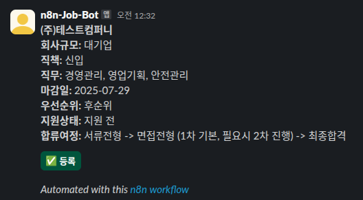

# AI 기반 채용 공고 자동 정리 워크플로우

AI 기반 채용 공고 자동 정리 워크플로우로 이메일로 수신된 채용 공고를 자동 분석하고, Slack 인터랙션을 통해 사용자의 확인을 거쳐 Notion 템플릿에 기록하는 자동화 시스템입니다.

<br></br>
## ⚠️ 안내 사항

본 프로젝트는 실제 채용 정보를 자동화하여 수집·분석하는 구조를 테스트하고자 하였습니다.  
하지만 실제 기업의 채용공고를 무단으로 수집하거나 크롤링하는 행위는 저작권 및 서비스 이용 정책 위반의 소지가 있어, **실제 공고 데이터를 그대로 활용하는 대신**, 공고 양식과 구조와 유사한 **테스트용 샘플 데이터를 직접 제작하여 사용하였습니다**.  
이를 통해 실제 채용 시스템과 유사한 흐름을 충분히 검증할 수 있도록 구성하였습니다.

<br></br>
## 📌 주요 기능

- 📩 **Gmail 연동**: 채용 관련 이메일 수신 시 워크플로우 자동 트리거
- 🧠 **OpenAI 분석**: 이메일 본문에서 기업명, 직무, 마감일 등 핵심 정보 추출
- 📤 **Slack 메시지 전송**: BlockKit을 활용해 채용 정보를 요약하여 Slack 전송
- ✅ **버튼 클릭 시 등록**: 사용자가 Slack에서 '등록' 버튼을 클릭하면 Notion에 자동 기록
- 🗂️ **Notion 연동**: 지정된 템플릿에 정보가 정리되어 기록됨

<br></br>
## 🛠 기술 스택

- **n8n**: 전체 워크플로우 자동화
- **Gmail API**: 이메일 트리거
- **OpenAI GPT-4**: 자연어 처리 및 정보 추출
- **Slack API**: 메시지 전송 및 인터랙션 처리
- **Notion API**: 데이터 정리 및 저장

<br></br>
## 🧩 워크플로우 구조


<br></br>
## 🖼️ 예시 화면

### 1️⃣ 채용공고 이메일 캡처  
실제 Gmail로 수신된 채용 안내 이메일 예시입니다.  
본문 내용을 기반으로 AI가 기업명, 직무, 마감일 등 핵심 정보를 추출합니다.


<br></br>
### 2️⃣ Slack 알림 메시지  
OpenAI 분석 결과를 바탕으로 BlockKit 형식으로 구성된 메시지입니다.  
사용자는 Slack에서 `✅ 등록` 버튼을 눌러 공고를 Notion에 저장할 수 있습니다.



<br></br>
### 3️⃣ Notion 등록 결과  
버튼 클릭 시 자동으로 채용 정보가 Notion 템플릿에 기록됩니다.  
기업명, 직무, 마감일, 지원상태, 우선순위 등이 정리된 형태로 저장됩니다.


<br></br>
## 🚀 설치 및 실행 방법

1. **n8n 설치 및 실행**
   - [공식 가이드](https://docs.n8n.io/) 참고
   - Docker 또는 로컬 환경에서 실행 가능

2. **Credential 설정**
   - Gmail, Slack, Notion, OpenAI API Key를 n8n에서 설정

3. **Spring Boot 서버 실행**
   - `/recruitapi` 폴더로 이동 후 아래 명령어로 실행
<br></br>
     ```bash
     ./gradlew bootRun
     ```

4. **워크플로우 불러오기**
   - `/workflow/email_to_notion_workflow.json` 파일을 n8n에 Import

5. **전체 흐름 테스트**
   - 테스트 이메일 수신 → Slack 알림 발송 → 버튼 클릭 → Notion 등록 확인


<br></br>
### 📝 사용된 Notion 템플릿 안내

- 본 프로젝트는 채용 정보 자동 등록 시, 아래 공개 Notion 템플릿을 참고하여 구성된 **자동화용 템플릿 구조**를 사용합니다.

| 항목 | 설명 |
|------|------|
| 템플릿 이름 | **취업 지원 현황 정리 보드** |
| 제작자 | [자소서 트레이너](https://notion.com/templates/jasoseotrainer) |
| 템플릿 링크 | [https://notion.com/templates/jasoseotrainer](https://notion.com/templates/jasoseotrainer) |

> ⚠️ 해당 템플릿은 Notion 템플릿 마켓의 공개 템플릿이며, 본 프로젝트는 템플릿을 복제하여 구조만 참고하고 자동화 목적에 맞게 수정하여 사용하였습니다.
